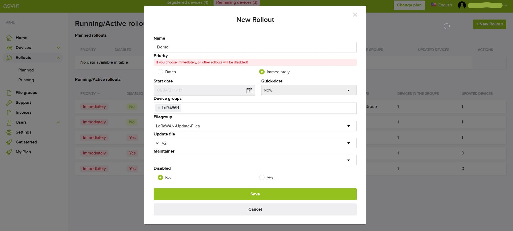

# lorawan-fuota-mbed-os-example
The example of FUOTA over LoRaWAN

This example is forked from the repo https://github.com/ARMmbed/mbed-os-example-lorawan-fuota

Target device: [L-TEK FF1705](https://os.mbed.com/platforms/L-TEK-FF1705/)

## Steps to build the application
1. Install [Mbed Studio-1.2.1](https://os.mbed.com/studio/)
2. Import this repository via:
    ```
    $ mbed import https://github.com/asvin-io/lorawan-fuota-mbed-os-example.git
    ```
3. In source folder, rename the device_details_copy.h file to device_details.h. Then specify the `APP_EUI`, `APP_KEY`, `GEN_APP_KEY`, and `FW_VER_STR` in device_details.h file. Here the `DEV_EUI` will be fetched from the internal memory. Please specify this Device EUI in your ChirpStack Application.
4. Also provide asvin device and user credentials in device_details.h
5. In mbed_app.json specify the frequency plan
6. Build the application using:
    ```
    $ mbed compile -m FF1705_L151CC -t GCC_ARM --profile=./profiles/tiny.json
    ```
    This will create binary files in `BUILD/FF1705_L151CC/GCC_ARM-TINY/` folder
7. From the folder `BUILD/FF1705_L151CC/GCC_ARM-TINY/` copy the `mbed-os-example-lorawan-fuota.bin` file to the development board (mounted as flash storage device).
8. After flashing, press on-board reset button and connect the device to serial monitor with baud rate of 115200 to view the device logs.


## Signing tool installation and setup of keys
`Tip!!` On Windows, it is better to use Ubuntu18 on WSL2 to run this tool 
1. Requirements: [Node.js 8 o higher](https://nodejs.org/en/), [Python 2.7](https://www.python.org/download/releases/2.7/), [OpenSSL](https://www.openssl.org/)
2. Install the [lorawan-fota-signing-tool](https://github.com/janjongboom/lorawan-fota-signing-tool):
    ```
    $ npm install lorawan-fota-signing-tool -g
    ```
3. Create a public/private key pair:
    ```
    $ lorawan-fota-signing-tool create-keypair -d yourdomain.com -m your-device-model-string
    ```
    Example: 
    ```
    $ lorawan-fota-signing-tool create-keypair -d abc.com -m LTEK
    ```

## Creating a delta update
1. Before building the aplication with new updates, copy the file `mbed-os-example-lorawan-fuota_update.bin` to `./updates` folder. And rename it as `v1_update.bin`
2. Now build the application with updates. It will create binary files with necessary updates in `BUILD/FF1705_L151CC/GCC_ARM-TINY/` folder
3. Then copy the file `mbed-os-example-lorawan-fuota_update.bin` to `./updates` folder. And rename it as `v2_update.bin`
4. Create the delta file using:
    ```
    $ lorawan-fota-signing-tool sign-delta --old ./updates/v1_update.bin --new ./updates/v2_update.bin --output-format bin -o ./updates/v1_to_v2.bin
    ```

## Firmware update using [asvin platform](https://app.asvin.io/)
1. Upload the diff file `v1_to_v2.bin` to the filegroup of LoRaWAN update files.
2. Then create fuota deployment rollout in the rollouts tab
    
3. This will create a Multicast-group for the mulcast session setup and distribute update
4. After successful update, the device sends a success status LoRa uplink which will be used to store the current running firmware version of the end node.


